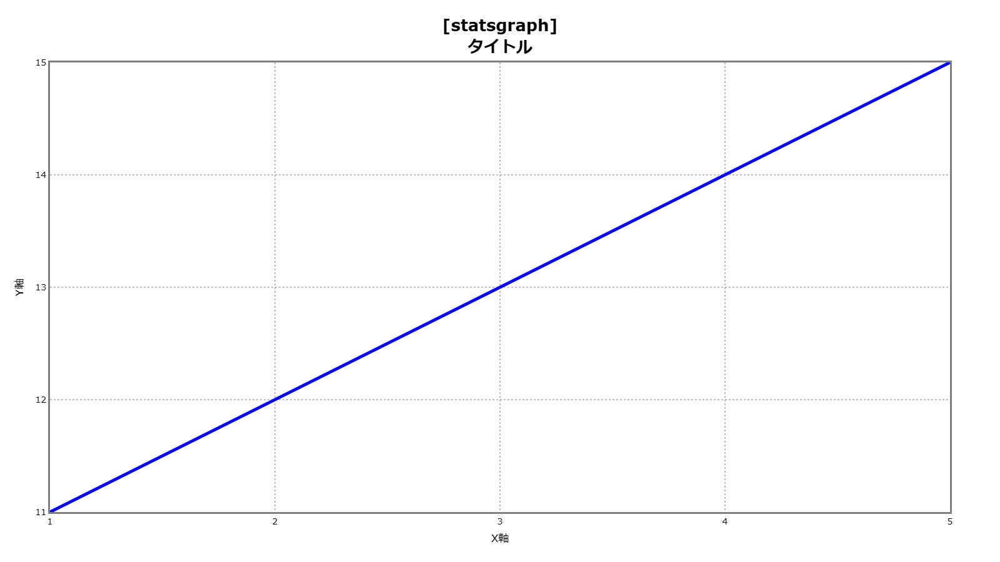

# graspgraph
Create easy-to-understand graphs

## Versions

|Version|Summary|
|:--|:--|
|0.1.0|Release graspgraph|

## Installation

`pip install graspgraph`

## Usage
### statsgraph

```python
import graspgraph as gg

def test_statsgraph_usage():
  statsgraph = gg.Statsgraph(
    gg.StatsgraphAxis([1, 2, 3, 4, 5]),
    gg.StatsgraphAxis([11, 12, 13, 14, 15]),
    gg.FigureColors(line = "blue"))
  figure = statsgraph.to_figure_helper()
  figure.LayoutTitleText = "<b>[statsgraph]<br>タイトル</b>"
  figure.XTitleText = "X軸"
  figure.YTitleText = "Y軸"
  figure.write_image("./images/stats/usage.png")
```
